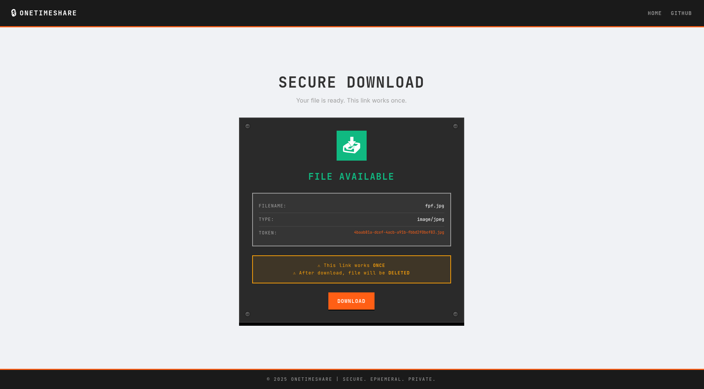
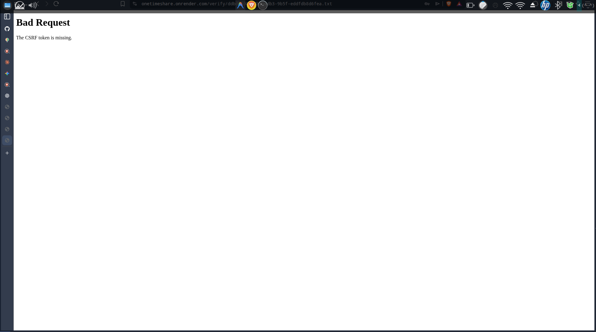

#  critical bug found

# date : 3 - 02 - 2026 

**sypnosis** :  password protected files cannto be downloaded due to bad csrf token configuration ;
 
**steps to reproduce** : 
 
1. upload a file 
2. set password to it 
3. try to download the file  with corect password 
4. it will fail with 403 forbidden error 

**expected result** :  

    

**actual result** :  

    

