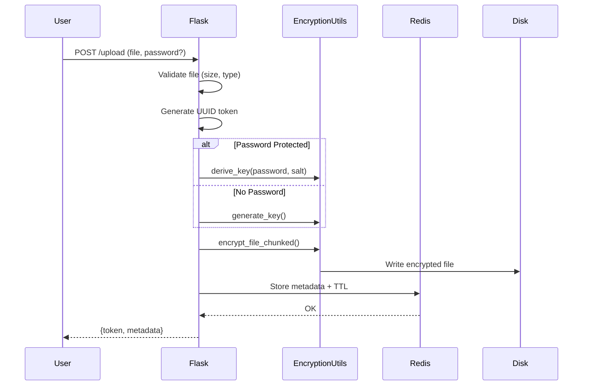
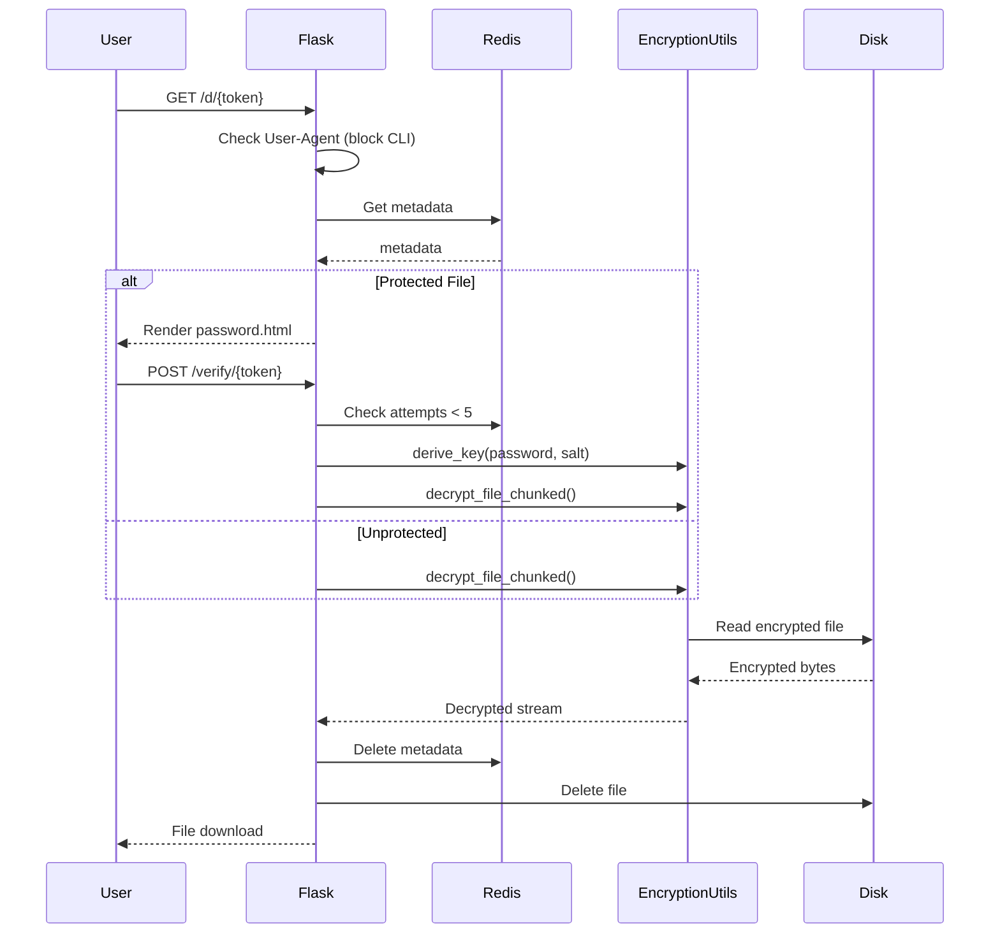

# OneTimeShare Architecture

## System Overview

```mermaid
flowchart TB
    subgraph Client["Client Layer"]
        Browser["🌐 Browser"]
        CLI["💻 CLI (Blocked)"]
    end

    subgraph Gateway["Gateway Layer"]
        Nginx["Nginx/Render Proxy"]
        RateLimit["⚡ Rate Limiter"]
        SecurityHeaders["🛡️ Security Headers"]
    end

    subgraph Application["Application Layer"]
        Flask["🐍 Flask App"]
        Gunicorn["⚙️ Gunicorn (4 workers)"]
        
        subgraph Routes["Routes"]
            Upload["/upload"]
            Download["/d/:token"]
            Verify["/verify/:token"]
            Admin["/auth/*"]
        end
        
        subgraph Services["Services"]
            RedisService["RedisService"]
            Encryption["EncryptionUtils"]
            Password["PasswordUtils"]
        end
    endmermaid 

    subgraph Data["Data Layer"]
        Redis[("🔴 Redis\n(Metadata + TTL)")]
        Disk[("💾 Disk\n(Encrypted Files)")]
    end

    Browser --> Nginx
    CLI -.->|"406 Blocked"| Nginx
    Nginx --> RateLimit
    RateLimit --> SecurityHeaders
    SecurityHeaders --> Gunicorn
    Gunicorn --> Flask
    Flask --> Routes
    Routes --> Services
    RedisService --> Redis
    Encryption --> Disk
```

---

## Request Flow: Upload



---

## Request Flow: Download



---

## Security Layers

```mermaid
flowchart LR
    subgraph L1["Layer 1: Network"]
        HTTPS["🔒 HTTPS/TLS"]
        Headers["Security Headers"]
    end
    
    subgraph L2["Layer 2: Application"]
        RateLimit["Rate Limiting"]
        CLIBlock["CLI Blocking"]
        Auth["Admin Auth"]
    end
    
    subgraph L3["Layer 3: Data"]
        Encrypt["ChaCha20 Encryption"]
        Argon2["Argon2id KDF"]
        TTL["Redis TTL"]
    end
    
    subgraph L4["Layer 4: Physical"]
        Atomic["Atomic Delete"]
        Cleanup["Orphan Cleanup"]
    end
    
    L1 --> L2 --> L3 --> L4
```



---

## Technology Stack

| Layer          | Technology                      |
| -------------- | ------------------------------- |
| **Frontend**   | HTML, CSS, JavaScript           |
| **Backend**    | Python 3.13, Flask 3.x          |
| **WSGI**       | Gunicorn                        |
| **Database**   | Redis (ephemeral)               |
| **Encryption** | ChaCha20-Poly1305, Argon2id     |
| **Auth**       | Flask-Login, Flask-JWT-Extended |
| **Testing**    | pytest, Playwright              |
| **CI/CD**      | GitHub Actions                  |
| **Deployment** | Render (Docker)                 |
